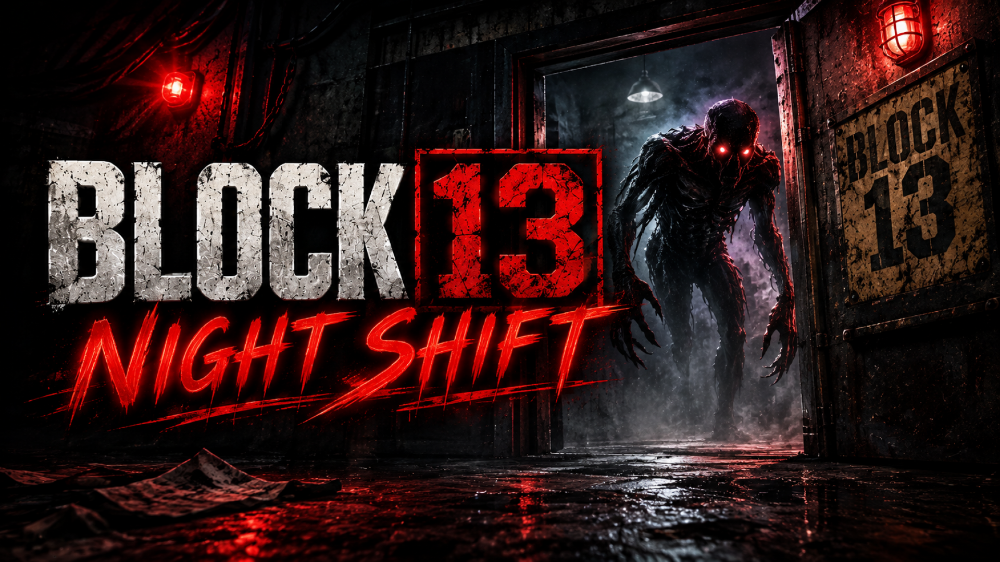

# Block 13: Night Shift
Make your night shift as the block guard and don't let any shapeshifters into the building or you will respond for all the killings.

You are the night guard of Block 13 — a crumbling Soviet-era apartment block where something is very wrong.

Every night, visitors appear at the window claiming to be residents. Some are telling the truth. Some are shapeshifters wearing stolen faces. One wrong decision — letting the wrong one in, or turning away someone real — ends the night, and the building remembers.

YOUR TOOLS:
• Passport — The identity they present. Press E to inspect.
• Journal — The truth about every resident in the building.
• Belongings — A keychain, letter, book, or receipt on the tray. Cross-reference with the journal.
• Phone — Call the number they gave and listen to who answers.
• Intercom — Ask them questions and compare answers with what you know.

DECISION TIME:
• Press the GREEN button to let them in.
• Press the RED button to deny them.
• Wrong choice = game over.

WHAT MAKES IT HARD:
• Shapeshifters forge the passport, so it always "matches." The real clues hide in the details — an off-by-one apartment number, a stranger's keychain, a story that doesn't line up with the journal.
• Don't trust one tool alone — on later nights a shapeshifter can answer every intercom question cleanly while the lie sits in a belonging on the tray.
• Cross-reference EVERYTHING.

FEATURES:
• 7 progressively harder nights
• 10 unique residents with deep backstories
• Multiple tools to investigate each visitor
• Boss encounters with unique shapeshifter types (Echo, Forger, Mimic)
• Horror atmosphere with ambient sound design
• Achievement system with 10 unlockable achievements
• Procedurally generated visitor encounters for high replayability

Survive all 7 nights. Prove you belong in the block.

--- CONTROLS ---

WASD ........... Move
Mouse ........... Look around
E ............... Interact / Inspect items (passport, journal, phone, keys, letter, book, receipt)
Green Button .... Let the visitor in
Red Button ...... Deny the visitor
Esc ............. Pause menu
Shift ........... Run
Mouse Click ..... Make decisions

--- SYSTEM REQUIREMENTS ---

• Browser: Chrome, Firefox, Edge, Safari (modern versions)
• WebGL support required
• Works on desktop and mobile (touch controls recommended for mobile)
• No installation needed — runs in browser
